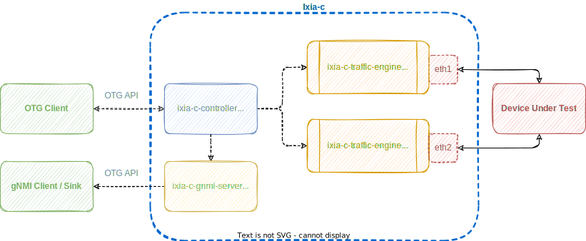
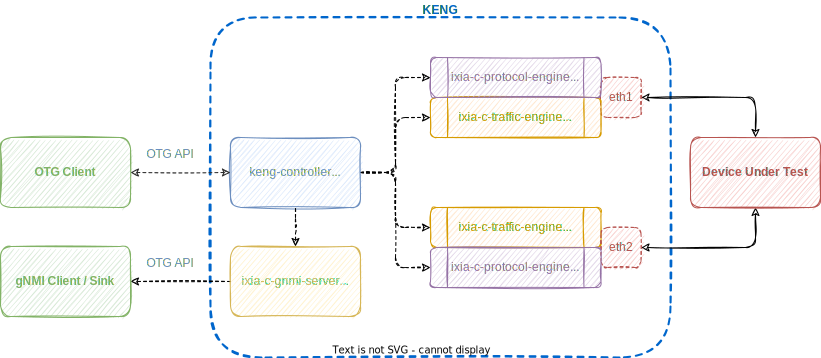

# Implementations

## Overview

To apply OTG in practice, an OTG-compatible tool, typically a Traffic Generator, is needed. There are several implementations available, and the list is growing:

* [**Ixia-c**](https://ixia-c.dev): containerized traffic generator from Keysight, with a Community Edition
* [**Keysight Elastic Network Generator**](https://www.keysight.com/us/en/products/network-test/protocol-load-test/keysight-elastic-network-generator.html): commercial offering of containerized Ixia-c Traffic Generator from Keysight
* [**IxNetwork**](https://www.keysight.com/us/en/products/network-test/protocol-load-test/ixnetwork.html): [snappi-ixnetwork](https://github.com/open-traffic-generator/snappi-ixnetwork) enables running OTG/snappi scripts with Keysight IxNetwork
* [**Magna**](https://github.com/openconfig/magna): open-source OTG implementation from [OpenConfig project](https://openconfig.net/)
* [**TRex**](https://trex-tgn.cisco.com/): [snappi-trex](https://github.com/open-traffic-generator/snappi-trex) enables running OTG/snappi scripts with TRex. Supports layer 2-3 Traffic Flows
* [**Spirent**](https://github.com/Spirent-STC): [stc-otg-setup](https://github.com/Spirent-STC/stc-otg-setup) enables running OTG/snappi scripts with STC. 
## Ixia-c

[Ixia-c](https://ixia-c.dev) is a modern, powerful and API-driven traffic generator designed to cater to the needs of hyperscalers, network hardware vendors and network automation professionals.

It is available both as a free Community Edition as well as a commercial edition, Keysight Elastic Network Generator (KENG), from Keysight. Ixia-c is distributed / deployed as a multi-container application consisting of a controller, traffic and protocol engines, and an optional gNMI server.

As a reference implementation of Open Traffic Generator API, Ixia-c supports client libraries in various languages, most prevalent being snappi for Python and gosnappi for Go.

### Community Edition

Components of Ixia-c Community Edition are:

* **Ixia-c Controller** serves as an OTG API Endpoint over HTTPs and gRPC
* **Ixia-c gNMI Server** exposes OTG Metrics over gNMI
* **Ixia-c Traffic Engine (TE)** controls Test Ports and is responsible for transmitting and receiving Traffic Flows

Fig. 1. Ixia-c Traffic Engine Deployment Diagram

Ixia-c Community Edition is limited to:

* Traffic Flows with **all capabilities**
* **Basic traffic performance** via raw Linux sockets
* **Up to 4** Test Ports in one session
* **No L2 protocols** on Test Ports
* Emulated Devices **without control plane protocols**
* Support via **Slack channel**

## KENG

[Keysight Elastic Network Generator](https://www.keysight.com/us/en/products/network-test/protocol-load-test/keysight-elastic-network-generator.html) (KENG) is the commercial edition of Ixia-c with added capabilities:

* **Accelerated traffic performance** via DPDK PCI
* **Unlimited number** of Test Ports per session
* Support of **L2 protocols** on Test Ports
* Emulated Devices **with control plane protocols**
* **Keysight Support** with SLAs

Components of KENG are:

* **KENG Controller** serves as an OTG API Endpoint over HTTPs and gRPC
* **Ixia-c gNMI Server** exposes OTG Metrics over gNMI
* **Ixia-c Traffic Engine (TE)** controls Test Ports and is responsible for transmitting and receiving Traffic Flows
* **Ixia-c Protocol Engine (PE)** is responsible for L2-3 protocol emulation

Fig. 2. Keysight Elastic Network Generator Deployment Diagram

## IxNetwork

Keysight's [**IxNetwork**](https://www.keysight.com/us/en/products/network-test/protocol-load-test/ixnetwork.html) is a tool for performance testing of Layer 2/3 switches and routers.  It is capable of emulating a large number of routing protocols and generating terabytes of data.  It runs on a large variety of Keysight's hardware based traffic generators and is also available in an all software form factor.  

The [**snappi-ixnetwork**](https://github.com/open-traffic-generator/snappi-ixnetwork) plugin allows execution of OTG [snappi](clients.md#snappi) scripts against an IxNetwork based traffic generator.

Fig. 3. snappi-ixnetwork Deployment Diagram

The above diagram gives a high level overview of how a Python script written using the snappi API uses IxNetwork REST API to configure Keysight's load modules to generate traffic.

The snappi-ixnetwork plugin supports Keysight's [AresONE](https://www.keysight.com/us/en/products/network-test/network-test-hardware/aresone-400ge.html) (400 Gbps) and [Novus](https://www.keysight.com/us/en/products/network-test/network-test-hardware/novus-qsfp28-1005025ge.html) (100 Gbps) based load modules.

## Magna

[Magna](https://github.com/openconfig/magna) traffic generator is an open-source OTG implementation from OpenConfig project. Magna is designed to be modular, such that it can be easily extended for new use cases. The base implementation does not cover all the OTG APIs, or functionality. More complete implementations such as Ixia-c are likely to be more suited to ongoing testing, an implementation like Magna allows additional flexibility to cover features not yet supported in these implementations, or to test independently of a third-party implementation.

## TRex

[**snappi-trex**](https://github.com/open-traffic-generator/snappi-trex) is a plugin that allows executing [snappi](https://github.com/open-traffic-generator/snappi) scripts with [TRex Traffic Generator](https://trex-tgn.cisco.com).

The plugin converts Open Traffic Generator configuration into the equivalent TRex STL Client configuration. This allows users to leverage TRex capabilities without having to write complex STL scripts.

Fig. 4. OTG interface for TRex using snappi-trex plugin

The above diagram outlines the overall process of how the Open Traffic Generator API is able to interface with TRex and generate traffic over its network interfaces.

The snappi-trex plugin supports stateless **Traffic Flows** over **Test Ports**. For the full list of supported OTG capabilities, see [snappi-trex documentation](https://github.com/open-traffic-generator/snappi-trex/blob/main/docs/features.md).

## Spirent
[**stc-otg-setup**](https://github.com/Spirent-STC/stc-otg-setup) an OTG and gNMI service that enables all versions of Spirent TestCenter (hardware and virtual) to participate in snappi, gosnappi and ONDATRA test cases for traffic generation and analysis