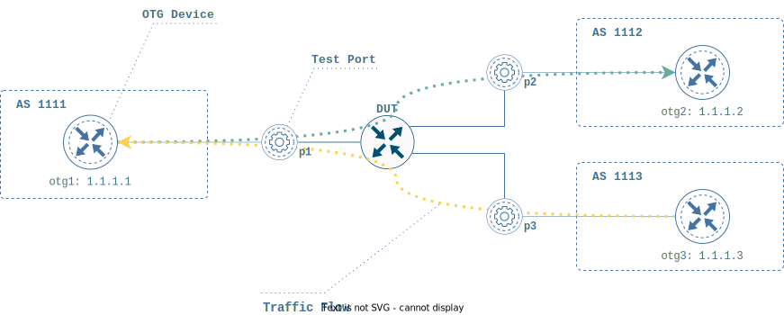

# Home

## Overview

Open Traffic Generator (OTG) APIs and data models are northbound API specifications for modern Traffic Generators and Protocol Emulators designed to test Layer 2-7 network devices. They include support for testing  forwarding as well as control planes. OTG APIs are:

* Open
* Vendor-neutral
* Intent-based
* Declarative

The formal [model specification](https://github.com/open-traffic-generator/models/blob/master/artifacts/openapi.yaml) can be found on GitHub under [Open Traffic Generator](https://github.com/open-traffic-generator) organization. To explore the model, a viewer friendly [**ReDoc rendering**](https://redocly.github.io/redoc/?url=https://raw.githubusercontent.com/open-traffic-generator/models/master/artifacts/openapi.yaml) is available as well. The OTG APIs support both REST and gRPC interfaces.

## Features

OTG is an actively developed specification, with contributions from real [use cases](/examples/#use-cases). The model allows to express the following building blocks of a traffic generator configuration:
<!-- TODO add links from bold items to paragraphs in Model section -->
* **Test Ports** with Layer 1&2 capabilities, including:
	- LLDP, LAG, LACP
* Emulated **OTG Devices** with Layer 2&3 features:
	- IPv4, IPv6 interfaces
	- ARP, IPv6 ND
	- BGP, IS-IS routing protocols
* **Traffic Flows** 
    - associated with either Test Ports, or OTG Devices
	- expressing L2-4 properties like Ethernet, IPv4/IPv6, TCP/UDP
	- stateless or stateful capabilities for transport protocols
	- with implementation-specific application payload
* Run-time **Metrics** and traffic **Capture** capabilities

Fig. 1. Sample diagram of the OTG configuration with emulated BGP routers, traffic flows and a Device Under Test

## Implementations

To apply OTG in practice, an OTG-compatible tool, typically a Traffic Generator, is needed. There are several implementations available, and the list is growing:
 
* [**Ixia-c Community Edition**](https://ixia-c.dev): container-based traffic generator from Keysight. The Community Edition supports up to 4 Test Ports and stateless layer 2-3 Traffic Flows
* [**Keysigh Elastic Network Generator**](https://www.keysight.com/us/en/products/network-test/protocol-load-test/keysight-elastic-network-generator.html): commercial offering of OTG implementation for a family of Keysight/Ixia Traffic Generators
* [**IxNetwork**](https://www.keysight.com/us/en/products/network-test/protocol-load-test/ixnetwork.html): [snappi-ixnetwork](https://github.com/open-traffic-generator/snappi-ixnetwork) enables running OTG/snappi scripts with Keysight IxNetwork
* [**Magna**](https://github.com/openconfig/magna): open-source OTG implementation from [OpenConfig project](https://openconfig.net/)
* [**TRex**](https://trex-tgn.cisco.com/): [snappi-trex](https://github.com/open-traffic-generator/snappi-trex) enables running OTG/snappi scripts with TRex. Supports layer 2-3 Traffic Flows

## Clients

There are multiple ways to communicate with a Traffic Generator via the OTG API:
 <!-- TODO add links from bold items to paragraphs in Clients section -->
* **otgen** command-line tool is an easy way to start with
* **snappi** library to accelerate development of *Test Programs* written in Python or Go
* **direct REST or gRPC calls** as an alternative to using *snappi*
* **custom** OTG client applications

[snappi](https://pypi.org/project/snappi/) and [gosnappi](https://pkg.go.dev/github.com/open-traffic-generator/snappi/gosnappi) provide client side API libraries for the OTG specifications for Python and Golang respectively.  For other languages, SDKs can be built using [OpenAPI Generator](https://github.com/OpenAPITools/openapi-generator) (for REST API) or [protobuf tools](https://github.com/protocolbuffers/protobuf) (for gRPC).  

## Use Cases
 
Real use cases are the basis of OTG evolution. Notable open-source projects leveraging OTG:
 
* [OpenConfig Feature Profiles](https://github.com/openconfig/featureprofiles)
* [SONiC Testbed](https://github.com/sonic-net/sonic-mgmt)
* [SONiC-DASH CI Pipeline](https://github.com/Azure/DASH)

## Community

Use our community resources to get help with Open Traffic Generator applications, develop your own implementation, or contribute to OTG:
 
* [Open Traffic Generator on Github](https://github.com/open-traffic-generator)
* [Ixia-c Slack Support Channel](https://github.com/open-traffic-generator/ixia-c/blob/main/docs/support.md)
* [Contribution Guidelines](https://github.com/open-traffic-generator/ixia-c/blob/main/docs/contribute.md)